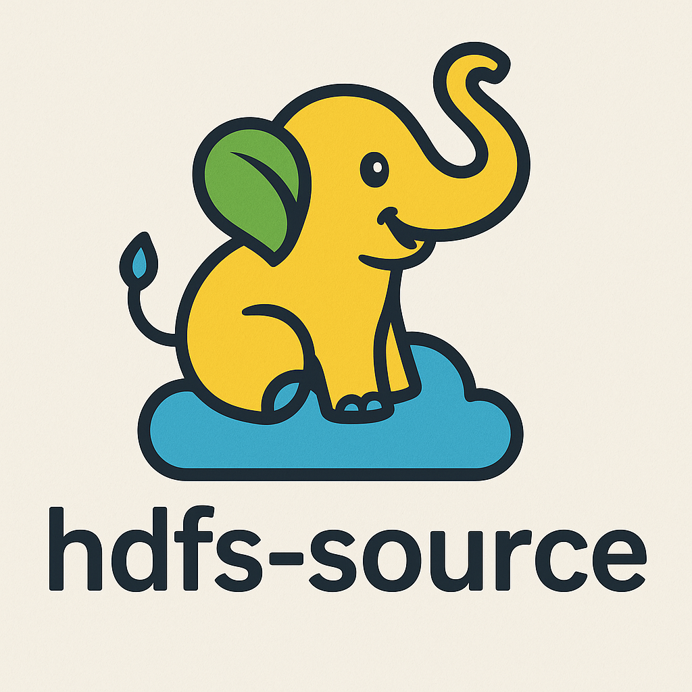

<p align="center">
  
</p>

# HDFS Source for Spring Cloud Data Flow

A Spring Cloud Data Flow compatible source application that reads files from a directory on HDFS and emits their contents as messages. Built with Spring Boot 3.4.5 and Java 21.

## Features
- Monitors a configurable directory on HDFS
- Emits file contents as messages (like the classic file source)
- Configurable poll interval, HDFS URI, and directory
- Modern Spring Boot 3.x and Java 21
- Uses native Hadoop client APIs for HDFS access
- Ready for SCDF 2.11.5 and later

## Configuration
All configuration is in `src/main/resources/application.properties` (or override via environment/command line):

```
hdfs.uri=hdfs://namenode:8020
hdfs.directory=/user/data/incoming
hdfs.poll-interval=5000
logging.level.root=INFO
```

## Build & Run
1. Build the project:
    ```sh
    ./mvnw clean package
    ```

2. **Standalone Mode** (HDFS → Local Directory):
    ```sh
    java -jar target/hdfs-source-0.0.1-SNAPSHOT.jar
    ```
    - Reads from HDFS and writes to the output directory specified in `application.properties`.

3. **SCDF Mode** (HDFS → RabbitMQ):
    ```sh
    java -jar target/hdfs-source-0.0.1-SNAPSHOT.jar --spring.profiles.active=scdf
    ```
    - Reads from HDFS and emits file contents as messages to the output binding (e.g., RabbitMQ) for Spring Cloud Data Flow.

## Deploy in Spring Cloud Data Flow
1. Register the app as a source in SCDF:
    ```
    app register --type source --name hdfs-source --uri file:///path/to/hdfs-source-0.0.1-SNAPSHOT.jar
    ```
2. Launch a stream using this source:
    ```
    stream create --name hdfs-to-log --definition "hdfs-source | log"
    stream deploy --name hdfs-to-log
    ```

## References
- [Spring Stream Applications Guide](https://docs.spring.io/stream-applications/docs/current/reference/html/index.html#)
- [Spring Cloud Data Flow Docs](https://docs.spring.io/spring-cloud-dataflow/docs/current/reference/htmlsingle/)
- [Hadoop FileSystem JavaDocs](https://hadoop.apache.org/docs/stable/api/org/apache/hadoop/fs/FileSystem.html)

---

## Code Documentation

This project is fully documented with JavaDoc and inline comments. Key classes:
- `HdfsFileSupplier`: SCDF-only, polls HDFS and emits file contents to message queue.
- `HdfsToLocalExporter`: Standalone mode, copies files from HDFS to local directory.
- `HdfsSourceApplication`: Entrypoint, switches between modes based on the active profile.
- `HdfsSourceProperties`: Configuration properties for HDFS connection and polling.

See the source code for detailed documentation.

---

## Development
- Java 21
- Spring Boot 3.4.5
- Spring Cloud 2024.x
- Apache Hadoop 3.x client
- Maven

## License
MIT
